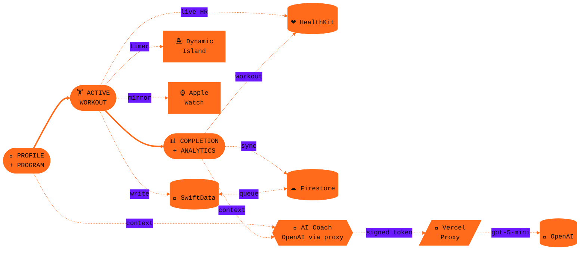

<div align="center">

```


      ██████╗  ██████╗ ██████╗ ██╗   ██╗
      ██╔══██╗██╔═══██╗██╔══██╗╚██╗ ██╔╝
      ██████╔╝██║   ██║██║  ██║ ╚████╔╝
      ██╔══██╗██║   ██║██║  ██║  ╚██╔╝
      ██████╔╝╚██████╔╝██████╔╝   ██║
      ╚═════╝  ╚═════╝ ╚═════╝    ╚═╝

      ███████╗ ██████╗ ██████╗  ██████╗ ███████╗
      ██╔════╝██╔═══██╗██╔══██╗██╔════╝ ██╔════╝
      █████╗  ██║   ██║██████╔╝██║  ███╗█████╗
      ██╔══╝  ██║   ██║██╔══██╗██║   ██║██╔══╝
      ██║     ╚██████╔╝██║  ██║╚██████╔╝███████╗
      ╚═╝      ╚═════╝ ╚═╝  ╚═╝ ╚═════╝ ╚══════╝


```

<kbd>&nbsp; **STRENGTH** &nbsp;</kbd> &nbsp; <kbd>&nbsp; **DATA** &nbsp;</kbd> &nbsp; <kbd>&nbsp; **DISCIPLINE** &nbsp;</kbd>

###### ━━━━━━━━━━━━━━━━━━━━━━━━━━━━━━━━━━━━━━━━━━━━━━━

<h3>A native iOS performance lab for serious lifters.</h3>

<p>
<sub><i>Real-time set logging · HealthKit biometrics · Dynamic Island rest timer · Apple Watch mirror · AI coach · Local-first sync</i></sub>
</p>

<br/>

[](https://www.apple.com/ios)
[](https://www.apple.com/watchos)
[](https://swift.org)
[](https://developer.apple.com/swiftui)
[](https://firebase.google.com)
[](https://openai.com)
[](#-license)

</div>

<br/>

```
  ┌─────────────────────────────────────────────────────────────────┐
  │                                                                 │
  │   "From the moment you grip the iron to the moment you rack     │
  │    it — zero friction. Just you, the bar, and the data."        │
  │                                                                 │
  └─────────────────────────────────────────────────────────────────┘
```

<br/>

<table align="center">
<tr>
<td align="center"><a href="#-overview"><b>OVERVIEW</b></a></td>
<td>·</td>
<td align="center"><a href="#-how-it-works"><b>FLOW</b></a></td>
<td>·</td>
<td align="center"><a href="#-features"><b>FEATURES</b></a></td>
<td>·</td>
<td align="center"><a href="#-integrations"><b>INTEGRATIONS</b></a></td>
<td>·</td>
<td align="center"><a href="#-architecture"><b>ARCHITECTURE</b></a></td>
<td>·</td>
<td align="center"><a href="#-stack"><b>STACK</b></a></td>
<td>·</td>
<td align="center"><a href="#-getting-started"><b>SETUP</b></a></td>
</tr>
</table>

<br/>

<!-- ─────────────────────────────────────────────────────────── -->

## ◢ &nbsp; OVERVIEW

> **Body Forge** is a performance-first workout tracker for iOS. Every screen is built for one-handed use mid-set. HealthKit reads happen in the background so heart rate and calories are ready the instant you need them. Data is local-first — the app is fully functional offline and syncs to Firestore when network is available.

<table>
<tr>
<td width="50%" valign="top">

#### ◆ &nbsp; What it does

```
▸  Logs sets, reps, weight, rest
▸  Streams live HR + calories
▸  Persists rest timer to the
   Dynamic Island & Lock Screen
▸  Mirrors the session to Apple
   Watch — rest haptic on wrist
▸  Syncs to Apple Health
▸  Detects PRs automatically
▸  Chats with an AI coach
▸  Tracks body composition
   over time
```

</td>
<td width="50%" valign="top">

#### ◆ &nbsp; What it isn't

```
✕  Yet another social feed
✕  A subscription paywall
✕  A nutrition tracker pretending
   to be a workout app
✕  A workout app pretending to
   be a nutrition tracker
✕  Cloud-only — your data lives
   on your device first
```

</td>
</tr>
</table>

<br/>

<!-- ─────────────────────────────────────────────────────────── -->

## ◢ &nbsp; HOW IT WORKS



<br/>

<table>
<tr>
<th align="left" width="60">STAGE</th>
<th align="left">PIPELINE</th>
<th align="left">CORE TYPES</th>
</tr>
<tr><td><code>01</code></td><td><b>Pick a program</b> — the day's plan loads from local storage</td><td><code>ProgramRepository</code> · <code>ProgramSeeder</code></td></tr>
<tr><td><code>02</code></td><td><b>Start the session</b> — Live Activity boots on the Dynamic Island</td><td><code>WorkoutStateMachine</code> · <code>LiveActivityManager</code></td></tr>
<tr><td><code>03</code></td><td><b>Log a set</b> — diff vs. last session, trend arrow rendered instantly</td><td><code>WorkoutManager</code> · <code>ProgressTrend</code></td></tr>
<tr><td><code>04</code></td><td><b>Rest timer</b> — counts down, updates Dynamic Island, fires haptic on iPhone + watch</td><td><code>WorkoutTimerService</code></td></tr>
<tr><td><code>05</code></td><td><b>Biometrics</b> — heart rate + active calories stream into the header</td><td><code>HealthKitService</code> · <code>ActiveWorkoutHeader</code></td></tr>
<tr><td><code>06</code></td><td><b>Watch mirror</b> — exercise, set, HR, calories, rest pushed to Apple Watch</td><td><code>WatchSyncBridge</code> · <code>BodyForgeWatch</code></td></tr>
<tr><td><code>07</code></td><td><b>Complete</b> — write to Apple Health, detect PRs, refresh analytics</td><td><code>PersonalRecordsService</code> · <code>AnalyticsService</code></td></tr>
<tr><td><code>08</code></td><td><b>Sync</b> — offline queue ships changes to Firestore on reconnect</td><td><code>OfflineQueueManager</code> · <code>WorkoutSyncService</code></td></tr>
</table>

<br/>

<!-- ─────────────────────────────────────────────────────────── -->

## ◢ &nbsp; FEATURES

###### `█ █ █ █ █ █ █ █ █ █ █ █ █ █ █ █ █ █ █ █ █ █ █ █ █ █ █ █ █ █ █ █ █ █ █ █ █ █ █ █ █ █ █ █ █ █ █ █ █ █ █ █ █ █ █ █ █ █ █ █ █ █ █ █ █ █ █ █`

<table>
<tr>
<td width="33%" valign="top">

### 🏋 &nbsp; <sub>MODULE 01</sub>

#### Workout Engine

Multi-day programs with full exercise customization. Per-set trend arrows compare against your last session in real time.

```
›  Strength  ·  Cardio  ·  Circuit
›  Superset support
›  100+ technique videos
›  Weekly goal · streaks · calendar
›  Shareable workout cards
```

</td>
<td width="33%" valign="top">

### ❤ &nbsp; <sub>MODULE 02</sub>

#### HealthKit Live

Heart rate and active calories streamed straight into the active workout header. Activity Rings closeable from the app.

```
›  Live HR + calories
›  Activity Rings card
›  Steps + sleep auto-pull
›  Workouts → Apple Health
```

</td>
<td width="33%" valign="top">

### 🏝 &nbsp; <sub>MODULE 03</sub>

#### Dynamic Island + Watch

Rest timer follows you everywhere — Dynamic Island, Lock Screen, and Apple Watch. Haptic fires on iPhone *and* on the wrist when rest ends.

```
›  ActivityKit Live Activity
›  Lock Screen presentation
›  Apple Watch mirror
›  Wrist haptic on rest end
```

</td>
</tr>
<tr>
<td valign="top">

### 📊 &nbsp; <sub>MODULE 04</sub>

#### Analytics Suite

Per-exercise 1RM trends rendered with Swift Charts. Body measurements, weight log, rolling averages — all in one hub.

```
›  WorkoutHistoryView
›  ProgressDetailView (1RM)
›  BodyMeasurementsView
›  WeightTrackerCard
```

</td>
<td valign="top">

### 🤖 &nbsp; <sub>MODULE 05</sub>

#### AI Coach

Conversational coach powered by **OpenAI `gpt-5-mini`**, reached through a Firebase-signed Vercel proxy — the API key never ships in the IPA. Context auto-built from your last sessions and metrics.

```
›  OpenAI gpt-5-mini backend
›  Key-less app — signed proxy
›  Auto-built workout context
›  History synced to Firestore
```

</td>
<td valign="top">

### 🍎 &nbsp; <sub>MODULE 06</sub>

#### Nutrition + Health

TDEE calculator with macro split. Supplement schedules, sleep guide, hormones reference — all native, all offline.

```
›  Calorie + macros calc
›  Nutrition guide
›  Supplement tracker
›  Sleep + hormones guides
```

</td>
</tr>
<tr>
<td valign="top">

### 🏆 &nbsp; <sub>MODULE 07</sub>

#### Gamification

Personal Records detected automatically. Achievement hub with detailed breakdown — get rewarded for actually showing up.

```
›  PR auto-detection
›  AchievementsHubCard
›  Detailed achievement view
›  Real-time PR celebrations
```

</td>
<td valign="top">

### 🔔 &nbsp; <sub>MODULE 08</sub>

#### Smart Nudges

Local notifications nudge you back after a week off the iron. No server-side push — fully on-device, fully private.

```
›  Inactivity detection
›  Local-only notifications
›  Configurable thresholds
›  Privacy-respecting
```

</td>
<td valign="top">

### 🔐 &nbsp; <sub>MODULE 09</sub>

#### Auth + Sync

Sign in with Apple, Google, or Email — with password reset. Local-first storage with offline queue ensures zero data loss when network drops.

```
›  Sign in with Apple
›  Google Sign-In
›  Email + Password + reset
›  GDPR account deletion
```

</td>
</tr>
</table>

###### `█ █ █ █ █ █ █ █ █ █ █ █ █ █ █ █ █ █ █ █ █ █ █ █ █ █ █ █ █ █ █ █ █ █ █ █ █ █ █ █ █ █ █ █ █ █ █ █ █ █ █ █ █ █ █ █ █ █ █ █ █ █ █ █ █ █ █ █`

<br/>

<!-- ─────────────────────────────────────────────────────────── -->

## ◢ &nbsp; INTEGRATIONS

<table>
<tr>
<th align="left" colspan="2"><sub>APPLE PLATFORM</sub></th>
</tr>
<tr><td></td><td>Biometrics, Activity Rings, workout writeback &nbsp;·&nbsp; <code>HealthKitService</code></td></tr>
<tr><td></td><td>Live Activity + Dynamic Island &nbsp;·&nbsp; <code>LiveActivityManager</code></td></tr>
<tr><td></td><td>Local-first persistence layer &nbsp;·&nbsp; entire <code>Storage/</code> module</td></tr>
<tr><td></td><td>1RM curves, body trends &nbsp;·&nbsp; <code>WorkoutProgressChart</code></td></tr>
<tr><td></td><td>Home-screen widgets + Live Activity UI &nbsp;·&nbsp; <code>GymTrackerWidget</code></td></tr>
<tr><td></td><td>iPhone ↔ Apple Watch state mirror &nbsp;·&nbsp; <code>WatchSyncBridge</code> · <code>BodyForgeWatch</code></td></tr>

<tr>
<th align="left" colspan="2"><sub>BACKEND &amp; AUTH</sub></th>
</tr>
<tr><td></td><td>User identity &nbsp;·&nbsp; <code>FirebaseAuthService</code> · <code>UserSessionManager</code></td></tr>
<tr><td></td><td>Cloud sync &nbsp;·&nbsp; <code>WorkoutSyncService</code> · <code>ProgramSyncService</code> · <code>ProfileSyncService</code></td></tr>
<tr><td></td><td>Native OAuth &nbsp;·&nbsp; <code>SignInWithAppleCoordinator</code></td></tr>
<tr><td></td><td>OAuth login &nbsp;·&nbsp; <code>AuthManager</code></td></tr>

<tr>
<th align="left" colspan="2"><sub>AI</sub></th>
</tr>
<tr><td></td><td>LLM inference for the in-app coach &nbsp;·&nbsp; <code>GroqClient</code> · <code>AICoachContextBuilder</code></td></tr>
<tr><td></td><td>Firebase-signed proxy in front of OpenAI — model &amp; key live server-side &nbsp;·&nbsp; <code>/api/ai-coach</code></td></tr>
</table>

<br/>

<!-- ─────────────────────────────────────────────────────────── -->

## ◢ &nbsp; ARCHITECTURE

```
   ┌───────────────────────────────────────────────────────────────┐
   │                                                               │
   │                       PRESENTATION                            │
   │           SwiftUI Views  ·  ViewModels  ·  Widgets            │
   │     ProgramView  │  ActiveWorkout  │  ProgressHub  │  …       │
   │                                                               │
   └────────────────────────────┬──────────────────────────────────┘
                                │
   ┌────────────────────────────▼──────────────────────────────────┐
   │                                                               │
   │                          DOMAIN                               │
   │   WorkoutManager  ·  WorkoutStateMachine  ·  Calculators      │
   │       AICoachContextBuilder  ·  AnalyticsService              │
   │              PersonalRecordsService                           │
   │                                                               │
   └────────────────────────────┬──────────────────────────────────┘
                                │
   ┌────────────────────────────▼──────────────────────────────────┐
   │                                                               │
   │                     INFRASTRUCTURE                            │
   │                                                               │
   │   ╔══════════╗   ╔══════════╗   ╔══════════╗   ╔══════════╗   │
   │   ║SwiftData ║   ║HealthKit ║   ║ Firebase ║   ║  Vercel  ║   │
   │   ║  Local   ║   ║   Apple  ║   ║   Cloud  ║   ║  → OpenAI║   │
   │   ╚══════════╝   ╚══════════╝   ╚══════════╝   ╚══════════╝   │
   │                                                               │
   └───────────────────────────────────────────────────────────────┘
```

<table>
<tr><td><b>PATTERN</b></td><td>MVVM + Repository + Dependency Injection (<code>/DI</code>)</td></tr>
<tr><td><b>CONCURRENCY</b></td><td>Swift Concurrency &nbsp;·&nbsp; <code>async/await</code> &nbsp;·&nbsp; <code>@MainActor</code></td></tr>
<tr><td><b>PRINCIPLES</b></td><td>Local-first &nbsp;·&nbsp; Offline-resilient &nbsp;·&nbsp; Single Source of Truth (SwiftData)</td></tr>
</table>

<br/>

<!-- ─────────────────────────────────────────────────────────── -->

## ◢ &nbsp; STACK

<table>
<tr><th align="left">LAYER</th><th align="left">TECHNOLOGY</th><th align="left">ROLE</th></tr>
<tr><td><sub>LANGUAGE</sub></td><td><b>Swift 5.9+</b></td><td>—</td></tr>
<tr><td><sub>UI</sub></td><td><b>SwiftUI</b></td><td>All screens and components</td></tr>
<tr><td><sub>ARCHITECTURE</sub></td><td><b>MVVM + DI</b></td><td>ViewModels · Managers · Services</td></tr>
<tr><td><sub>LOCAL STORE</sub></td><td><b>SwiftData</b></td><td>Offline-first persistence</td></tr>
<tr><td><sub>HEALTH</sub></td><td><b>HealthKit</b></td><td>Biometrics read/write</td></tr>
<tr><td><sub>LIVE</sub></td><td><b>ActivityKit</b></td><td>Dynamic Island + Lock Screen</td></tr>
<tr><td><sub>CHARTS</sub></td><td><b>Swift Charts</b></td><td>Trend visualization</td></tr>
<tr><td><sub>BACKEND</sub></td><td><b>Firebase Firestore</b></td><td>Cloud sync</td></tr>
<tr><td><sub>AUTH</sub></td><td><b>Firebase Auth</b> + Apple + Google</td><td>Identity</td></tr>
<tr><td><sub>AI</sub></td><td><b>OpenAI gpt-5-mini</b> via Vercel proxy</td><td>LLM inference for coach (key-less app)</td></tr>
<tr><td><sub>ASYNC</sub></td><td><b>Swift Concurrency</b></td><td>All async operations</td></tr>
<tr><td><sub>i18n</sub></td><td><b>String Catalog</b> + custom <code>LanguageManager</code></td><td>4 languages — 🇷🇺 RU · 🇬🇧 EN · 🇵🇱 PL · 🇩🇪 DE</td></tr>
<tr><td><sub>WIDGETS</sub></td><td><b>WidgetKit</b></td><td>Home screen + Live Activity UI</td></tr>
<tr><td><sub>WATCH</sub></td><td><b>watchOS 10 + WatchConnectivity</b></td><td>Wrist mirror of the active workout</td></tr>
</table>

<br/>

<!-- ─────────────────────────────────────────────────────────── -->

## ◢ &nbsp; PROJECT STRUCTURE

```
GymTracker/
│
├──  GymTracker/
│    │
│    ├──  Models/
│    │    ├──  AnalyticsModels.swift          ◆ analytics domain
│    │    ├──  ProgramModels.swift            ◆ training programs
│    │    ├──  SleepModels.swift              ◆ sleep
│    │    ├──  SyncModels.swift               ◆ Firestore DTOs
│    │    └──  ValueObjects/                  ◆ Email · Password · UserId
│    │
│    ├──  Services/
│    │    ├──  AICoach/                       ◆ OpenAI proxy client + context builder
│    │    ├──  Auth/                          ◆ Firebase Auth + Apple + Google
│    │    ├──  Health/                        ◆ HealthKit wrapper
│    │    ├──  Storage/                       ◆ SwiftData persistence
│    │    ├──  Sync/                          ◆ offline queue + Firestore sync
│    │    ├──  Workout/                       ◆ state machine + repositories
│    │    ├──  AnalyticsService.swift
│    │    ├──  CalorieCalculator.swift
│    │    ├──  PersonalRecordsService.swift
│    │    ├──  InactivityNotificationService.swift
│    │    ├──  WatchSyncBridge.swift          ◆ iPhone → Watch state mirror
│    │    └──  SleepService.swift
│    │
│    ├──  Protocols/                          ◆ service contracts
│    ├──  DI/                                 ◆ DI container
│    │
│    ├──  *View.swift                         ◆ SwiftUI screens
│    ├──  *ViewModel.swift                    ◆ view-scoped logic
│    ├──  WorkoutManager.swift                ◆ active session orchestrator
│    ├──  HealthManager.swift                 ◆ HealthKit facade
│    ├──  LiveActivityManager.swift           ◆ Live Activity lifecycle
│    ├──  SyncManager.swift                   ◆ sync orchestrator
│    ├──  AuthManager.swift                   ◆ auth facade
│    └──  DesignSystem.swift                  ◆ colors · typography · modifiers
│
├──  GymTrackerWidget/                        ◆ widget + Live Activity UI
├──  BodyForgeWatch Watch App/                ◆ watchOS companion app
│    ├──  BodyForgeWatchApp.swift
│    ├──  WatchRootView.swift
│    └──  WatchWorkoutModel.swift
├──  docs/
│    └──  WATCHOS_SETUP.md                    ◆ how to wire the Watch target
├──  GymTrackerTests/                         ◆ unit tests
└──  GymTrackerUITests/                       ◆ UI tests
```

<br/>

<!-- ─────────────────────────────────────────────────────────── -->

## ◢ &nbsp; LOCALIZATION

The app ships in **4 languages** — 🇷🇺 Russian · 🇬🇧 English · 🇵🇱 Polish · 🇩🇪 German. Strings live in a String Catalog, but the active language is driven by an in-app **`LanguageManager`** (switchable in Settings, independent of the system locale). Always resolve through `.localized()` — `String(localized:)` reads the *system* locale and silently ignores the user's in-app choice.

<table>
<tr>
<th align="left" width="50%">✕ &nbsp; WON'T PASS REVIEW</th>
<th align="left" width="50%">✓ &nbsp; CORRECT</th>
</tr>
<tr>
<td>

```swift
let title = "Settings"
let title = String(localized: "Settings") // ignores in-app language
```

</td>
<td>

```swift
let title = "settings_title".localized()
```

</td>
</tr>
</table>

> Full i18n protocol lives in [`CLAUDE.md`](./CLAUDE.md) → **LOCALIZATION & i18n PROTOCOL**.

<br/>

<!-- ─────────────────────────────────────────────────────────── -->

## ◢ &nbsp; GETTING STARTED

<details>
<summary><b>&nbsp; ▸ &nbsp; PREREQUISITES</b></summary>
<br/>

| | |
|---|---|
| **Xcode** | 15.0+ |
| **iOS** | 17.0+ device or simulator |
| **watchOS** | 10.0+ (optional — for the Apple Watch companion) |
| **Apple Developer** | required for HealthKit + Live Activities entitlements |
| **Firebase** | project with Firestore + Google Sign-In enabled |
| **AI coach** | *(optional)* a deployed Vercel proxy with `OPENAI_API_KEY` + `FIREBASE_SERVICE_ACCOUNT` set — the app talks to OpenAI only through it |

</details>

<br/>

#### <kbd>&nbsp;01&nbsp;</kbd> &nbsp; Clone the repo

```bash
git clone https://github.com/shurinbergo3/GymTracker.git
cd GymTracker
open "Body Forge.xcodeproj"
```

#### <kbd>&nbsp;02&nbsp;</kbd> &nbsp; Configure Firebase

Drop your `GoogleService-Info.plist` from the Firebase console into `GymTracker/GymTracker/`.
The file is git-ignored and required for auth and sync to function.

#### <kbd>&nbsp;03&nbsp;</kbd> &nbsp; Wire up the AI coach *(optional)*

The app never holds an OpenAI key — it calls a small **Vercel proxy** (`/api/ai-coach`) that authenticates each request with a Firebase ID token and forwards to OpenAI (`gpt-5-mini`). The model and reasoning effort are chosen server-side, so swapping models needs **no app update**.

```bash
vercel deploy --prod        # from the proxy folder
# then in the Vercel dashboard set:
#   OPENAI_API_KEY            — your OpenAI secret
#   FIREBASE_SERVICE_ACCOUNT  — service-account JSON for token verification
```

Point `GroqProxyConfig.endpoint` in [`GroqClient.swift`](GymTracker/GymTracker/Services/AICoach/GroqClient.swift) at your deployment.

#### <kbd>&nbsp;04&nbsp;</kbd> &nbsp; Sign all targets

In Xcode, select your development team under *Signing & Capabilities → Team* for:

> `GymTracker`
> `GymTrackerWidget`
> `BodyForgeWatch Watch App` *(if you've added the watch target — see [`GymTracker/docs/WATCHOS_SETUP.md`](GymTracker/docs/WATCHOS_SETUP.md))*

#### <kbd>&nbsp;05&nbsp;</kbd> &nbsp; Run

To test the Dynamic Island, pick an **iPhone 15 Pro / 16 Pro** simulator or a real device.
To test the wrist mirror, pair an **Apple Watch** (or a paired Watch simulator) and run the watch scheme.

```
⌘ + R
```

<br/>

<!-- ─────────────────────────────────────────────────────────── -->

## ◢ &nbsp; DEFINITION OF DONE

```
   ✓  Code passes linting and tests
   ✓  All user-facing strings localized via .xcstrings
   ✓  Result committed or saved in the project
   ✓  Task status updated in /directives/
   ✓  Manual /execution/ commands documented (if applicable)
```

<br/>

<!-- ─────────────────────────────────────────────────────────── -->

## ◢ &nbsp; LICENSE

**MIT** &nbsp;·&nbsp; do whatever you want, just keep the attribution.

<br/>
<br/>

<div align="center">

```
   ━━━━━━━━━━━━━━━━━━━━━━━━━━━━━━━━━━━━━━━━━━━━━━━━━━━━━━━━━━━

                BUILT  FOR  LIFTERS · BY  LIFTERS

   ━━━━━━━━━━━━━━━━━━━━━━━━━━━━━━━━━━━━━━━━━━━━━━━━━━━━━━━━━━━
```

<sub>Forged with Swift, sweat, and an obscene amount of espresso ☕</sub>

<br/>
<br/>

<sub>
<kbd>iOS 17+</kbd> &nbsp; <kbd>Swift 5.9</kbd> &nbsp; <kbd>SwiftUI</kbd> &nbsp; <kbd>SwiftData</kbd> &nbsp; <kbd>HealthKit</kbd> &nbsp; <kbd>ActivityKit</kbd> &nbsp; <kbd>Firebase</kbd> &nbsp; <kbd>OpenAI</kbd>
</sub>

</div>
